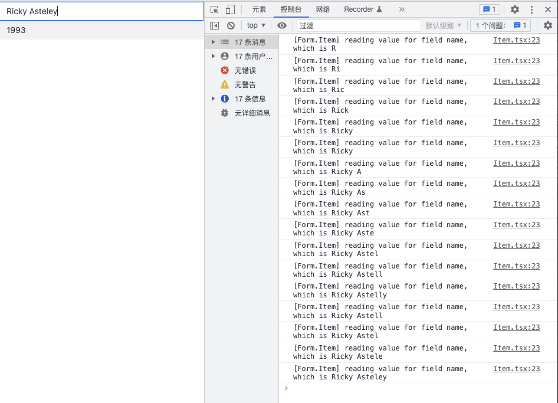

# Mobx Form Sample

## Introduction

This is a demonstration project that implements a fundamental React form solution hiring Mobx as the status management solution.

## Motivation

The reason I open this project is to develop a new practice to fulfill dependent field requirement in real enterprise application development. For example, the options of state are determined by country. Users will have `Californa` while choosing `United States`, whereas `Victoria` while choosing `Australia`. The antd Form solution did not provide any mechanism directly to our developers. We have to manage the options manually, sometimes sacrifizing performance as the trade off.

## Insights

### Fundamental Usage

The fundamental usage is designed to close the one from antd as much as possible. We have `Form` on the top, register a field by `Item`. However, this is a **under the hood** solution. There is no graphical implementation for the form.

```tsx
// Input and InputNumber is a component from antd or arco-design.
<Form>
  <Item name="name">
    {(value, onChange, _) => (
      <Input value={value} onChange={(value) => onChange(value)} />
    )}
  </Item>
  <Item name="age">
    {(value, onChange, _) => (
      <InputNumber value={value} onChange={(value) => onChange(value)} />
    )}
  </Item>
</Form>
```

As a benefit of using mobx, the update is precise. Only the fields that associated value changed are updated.



## Progress

Currently, I have implement the basic function for the demonstration. It is possible to register a field, read the value according to the name, update the data and refresh the field on the change event occured.
